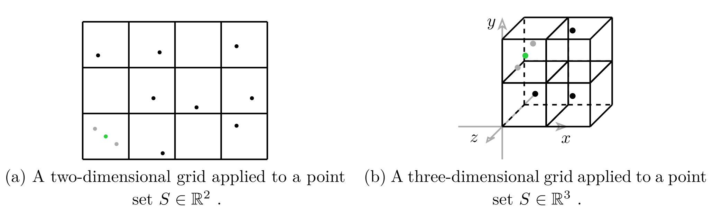

# Vertex Clustering

A small library to perform vertex clustering in two, three and four dimensions.

Vertex clustering is a technique that reduces the size of a point cloud.
A grid is laid over the points, grouping the vertices into clusters. Vertices that fall into the same cluster get approximated by a representative vertex.
The general idea is explained in more detail in [1].

The bin size _b_ of the model defines the grid resolution.
If _b_ is chosen largem the bins are larger and thus more vertices get approximated.
Similarly for lower _b_ less vertices fall into the same cluster and fewer vertices get approximated.

Currently this is the mean of the vertices, but other methods can be used as well.

## Example
The figures below shows an example visualization of clustering a small set of vertices for 2D and 3D case. The gray points in the respective bins with multiple vertices get represented by the green vertex after simplification.

## References
[1] J. Rossignac and P. Borrel, “Multi-resolution 3D approximations for rendering complex
scenes,” Modeling in computer graphics: methods and applications. Springer, pp. 455–
465, 1993
