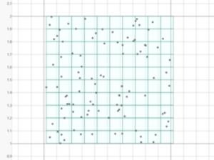
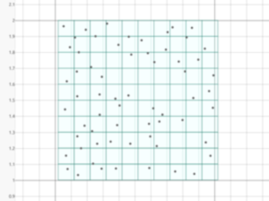

# Vertex Clustering

A small library to perform vertex clustering in two, three and four dimensions.

Vertex clustering is a technique that reduces the size of a point cloud.
A grid is laid over the points, grouping the vertices into clusters. Vertices that fall into the same cluster get approximated by a representative vertex.

The bin size _b_ of the model defines the grid resolution.
If _b_ is chosen largem the bins are larger and thus more vertices get approximated.
Similarly for lower _b_ less vertices fall into the same cluster and fewer vertices get approximated.

Currently this is the mean of the vertices, but other methods can be used as well.

## Example
The two images below show an example visualization of clustering 100 2D vertices with a bin size of _b = 0.1_ (the GUI is built with [egui](https://www.egui.rs/)).
|  |  |
|:--------------------------------:|:---------------------------------------------------------:|
| **Original Vertices**            | **Approximated Vertices**                                 |
